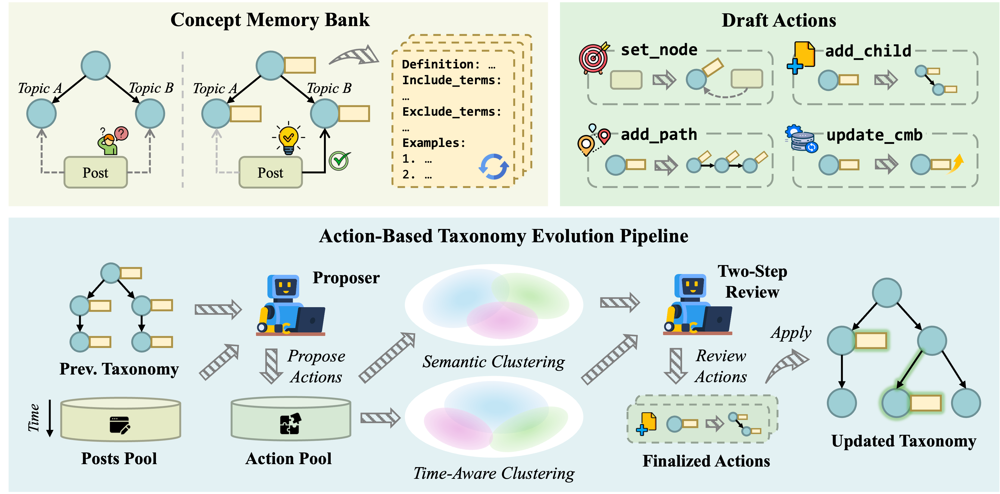

# EvoTaxo

[](LICENSE)
[](#)

EvoTaxo is a research codebase for building and evolving taxonomies from temporally ordered social media streams. 



## Method

EvoTaxo processes posts chronologically. For each post, it proposes a draft action over the current taxonomy, accumulates structural actions within time windows, clusters draft actions using semantic and temporal signals, and only applies edits after a refinement-and-arbitration review procedure. Each taxonomy node keeps a concept memory bank with evolving definitions and examples.

## Data

The `data/` folder contains dataset preparation scripts. We collect Reddit data with [Arctic Shift](https://github.com/ArthurHeitmann/arctic_shift), then convert raw archives into CSVs for EvoTaxo and optional zero-shot label filtering.

## Run

```bash
uv run python -m evotaxo.pipeline --input data/input.csv --output runs/demo
```

The pipeline auto-loads a local `.env` before reading API keys. Supported providers are OpenAI and OpenRouter.
The main runtime defaults are defined in `evotaxo/config.py`.

Example `.env`:

```bash
OPENAI_API_KEY=...
OPENROUTER_API_KEY=...
```

Example provider override:

```bash
uv run python -m evotaxo.pipeline \
  --input data/input.csv \
  --output runs/demo \
  --llm-provider openai \
  --llm-model gpt-4o-mini
```

## Output

Each run creates a timestamped output directory with:

- `config.json`: resolved configuration used for the run.
- `run.log`: execution log.
- `run_meta.json`: summary counts and run metadata.
- `taxonomy_after_bootstrap.json`: taxonomy right after optional bootstrap initialization.
- `taxonomy_nodes_final.json`: final taxonomy nodes.
- `taxonomy_node_post_counts_final.json`: final post counts per node.
- `taxonomy_by_window.jsonl`: taxonomy snapshots by time window.
- `post_assignments.csv`: post-to-node assignments.
- `action_proposals.jsonl`: raw draft actions proposed from posts.
- `clusters_overview.jsonl`: summaries of proposal clusters before final selection.
- `cluster_decisions.jsonl`: review and arbitration decisions.
- `taxonomy_after_clustering.jsonl`: taxonomy snapshots after each review batch.

## Evaluation

```bash
uv run python evaluate.py --run-dir runs/demo/<timestamp> --root-topic topic --output-dir metrics
```

The LLM-based evaluation metrics currently use the OpenAI judge client in `metrics/llm_client.py`:

```bash
OPENAI_API_KEY=...
```
